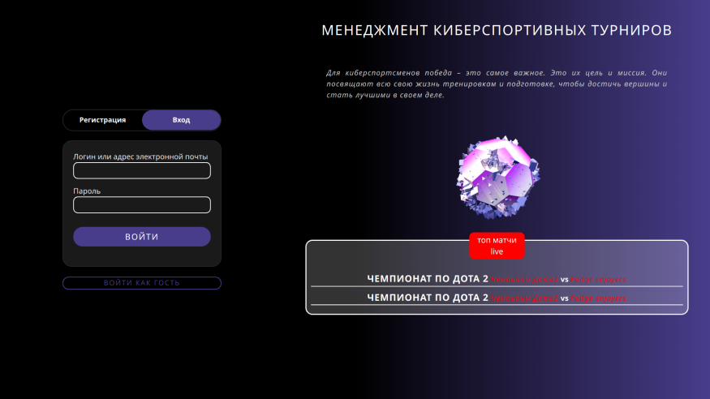
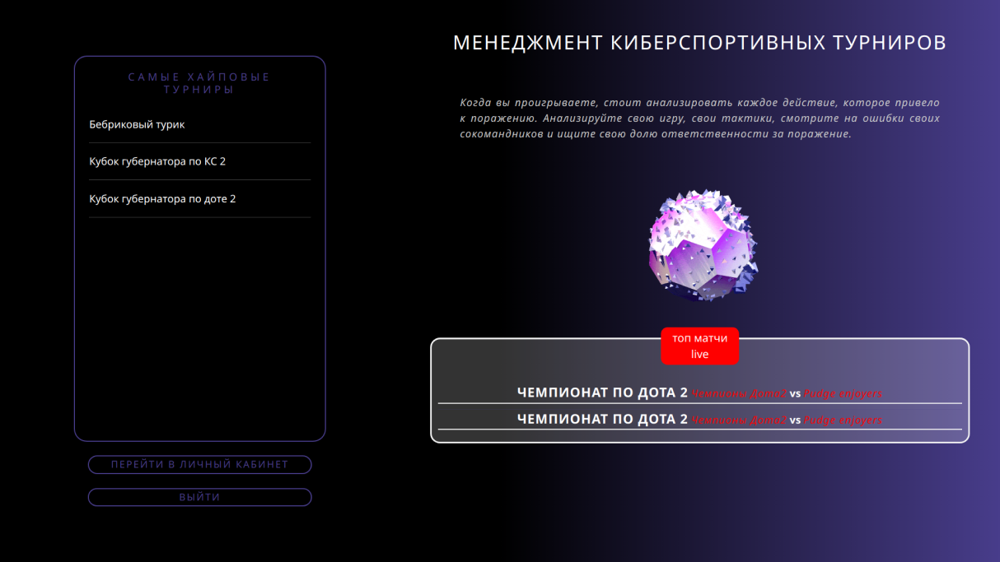

# Решение для проведения кибеспортивных турниров
Решение представляет собой веб приложение, разработанное на языке python с использованием фреймоврка Flask, библиотеками wtfoms, jinja2, работающее на основе СУБД - postgreSQL с использованием SQAlchemy

Были реализованы:
  - Аутентификация пользователей - судей и капитанов команд;
  - Создание и учет турниров;
  - Отображение проходящих в данный момент турниров;
  - Рассылка командам информации о предстоящих тур;
  - Обработка заявок на турниры;

